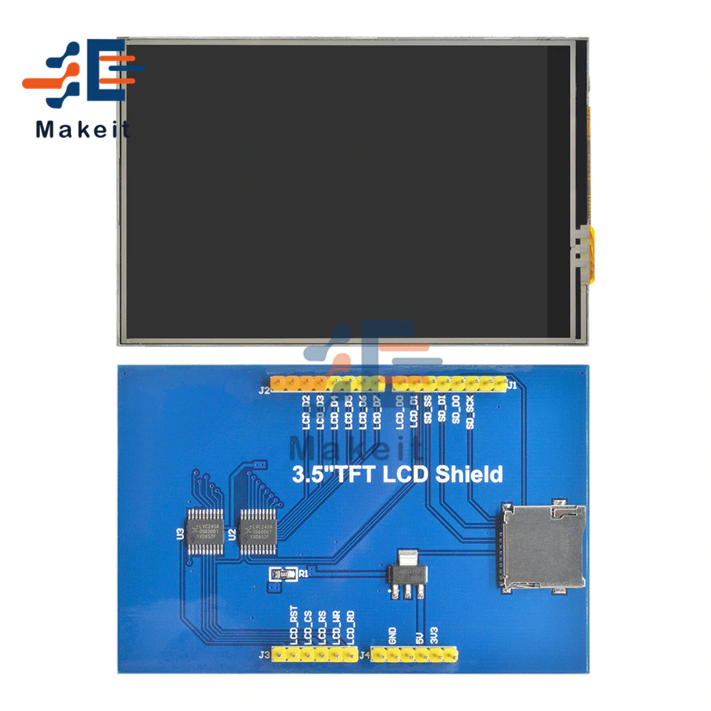

# PlatformIO Example for Wmos D1 R32 board with an ILI9486 Display

Test for a recent change made in .

Boards needs to be modified as described in https://github.com/Bodmer/TFT_eSPI#8-bit-parallel-support. 

## The board


## The board pinout

Per https://www.instructables.com/The-Greatest-Arduino-UNO-in-the-World/


## The display and pinout

Per http://www.lcdwiki.com/3.5inch_Arduino_Display-UNO 

As sold in https://www.aliexpress.com/item/1005001585779587.html



## Code pinmapping

If I saw everything correctly, and keeping in mind the modifications done to the board as above, the pinmapping is, when the board sits in the Arduino-header, as defined by

```
  -DTFT_RST=32
  -DTFT_CS=33
  -DTFT_RS=15
  -DTFT_WR=4
  -DTFT_RD=2
  -DTFT_D0=12
  -DTFT_D1=13
  -DTFT_D2=26
  -DTFT_D3=25
  -DTFT_D4=17
  -DTFT_D5=16
  -DTFT_D6=27
  -DTFT_D7=14
  ```

So e.g. RST = IO4 of th e ESP32. 